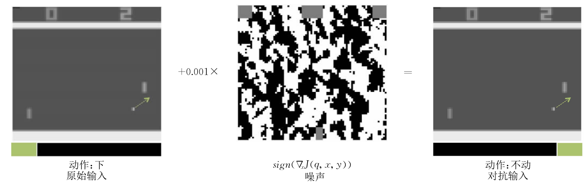
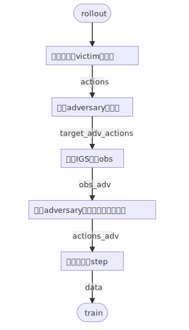
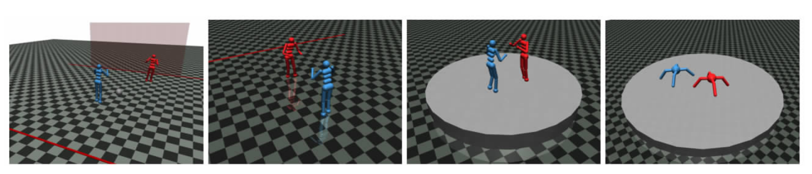
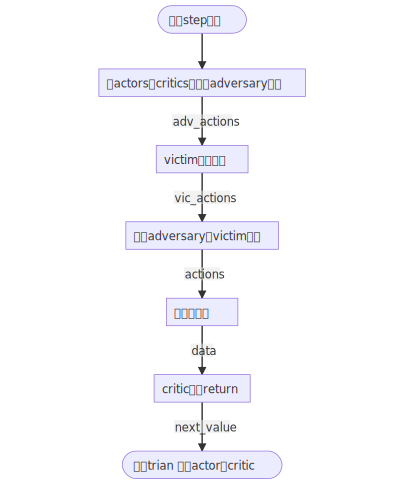

对抗攻击算法介绍
===================
基于强化学习其独有的马尔可夫过程的学习范式，对强化学习的攻击大致可分为基于状态 :math:`\mathcal{S}` 、基于奖励 :math:`R` 以及基于动作 :math:`\mathcal{A}` 的三种攻击方式 :cite:`liuaishan2023mianxiang` 。其中，基于状态 :math:`\mathcal{S}` 的攻击通过扰动智能体观测或者改变智能体观测结果，从而诱使智能体做出最小化目标函数的决策；基于奖励 :math:`R` 的攻击通过微小地扰动智能体训练过程中的奖励函数，从而影响智能体的全局策略；基于动作 :math:`\mathcal{A}` 的攻击直接对智能体的动作进行微小扰动，从而大幅影响智能体的目标函数，或通过训练具有对抗策略的智能体从而影响其他智能体决策。

基于观测空间的对抗扰动攻击
--------------

基于状态的攻击（如图 :ref:`figure_attack_state` 所示）可分为两类：基于观测的对抗攻击与基于环境的对抗攻击。其中，基于观测的对抗攻击主要通过扰动智能体的观测值 :math:`s` ，从而改变智能体策略 :math:`\pi(s) = p(s|a)` 来实现攻击 :cite:`behzadan2017vulnerability,huang2017adversarial` ；基于环境的对抗攻击在环境中添加对智能体观测值 :math:`s` 的扰动的同时，还要求此扰动符合状态转移方程 :math:`\mathcal{T}=p\left(s^{\prime}, r \mid s, a\right)` 。

.. _figure_attack_state:

.. figure:: ../_static/images/adv/attack_state.png
    :width: 60%
    :align: center

    基于状态的对抗攻击算法示意图

随机噪声攻击
^^^^^^^^^^^^^^^^^^^^^^^

Huang 等人 :cite:`huang2017adversarial` 最先对通过深度强化学习得到的策略进行攻击, 使用机器学习领域常用的快速梯度符号 (Fast gradient sign method, FGSM) :cite:`goodfellow2015explaining` 算法制造对抗扰动并将扰动直接添加到智能体的观测值上, 以此对深度学习智能体进行攻击。这项工作首次尝试并验证了由 DQN、TRPO 以及 A3C 这些算法得到的智能体容易受到对抗性扰动的攻击, 且对抗样本在不同强化学习算法得到的模型之间、在相同算法下得到的不同模型之间具有较好的迁移性。
 
**基本原理**

通过通过在输入图像上加入扰动（如图 :ref:`figure_fgsm` 中间部分放大后的对抗噪声扰动所示）对智能体的输入空间观测进行攻击，从而迷惑智能体决策动作（图片下方框为当前动作决策分布）。

.. _figure_fgsm:

    基于 FGSM 方法生成对抗样本

**形式化定义**

扰动智能体观测的对抗样本的目标为：对于智能体状态 :math:`s` ，给定一系列允许的扰动 :math:`B(s)` ，令 :math:`\nu(s) \in B(s)` 扰动后的智能体观测状态，使得强化学习达成的目标 :math:`G` 最小：

.. math:: 

    \min _{\theta} G_{t} & =\sum_{k=0}^{\infty} \gamma^{k} R_{t+k+1},\\
    \text{where} & \quad \nu_{\theta}(s) \in B(s), s^{\prime} \sim \mathcal{T}(s, a), a \sim \pi(\nu(s))

其中， :math:`\theta` 为 :math:`\nu(s)` 的参数。通过生成添加在状态 :math:`s` 上，且在允许扰动 :math:`B(s)` 范围内的噪声，攻击者的目标是最小化被攻击者的总奖励函数。

**随机高斯噪声攻击模块**

    随机高斯噪声攻击模块

**配置项**

.. code-block:: yaml

    # Unmodifiable configuration items
    num_env_steps: 0 # No training required, just perturb the observation
    perturb_iters: 0 
    adaptive_alpha: False
    targeted_attack: False

    # Modifiable configuration items
    # the id of adversarial agents
    adv_agent_ids: [0]
    # the range of timestep that can be perturbed, e.g.: "1-10,15,20"
    perturb_timesteps: ~
    # perturbation parameters
    # the budget of perturbation (in L-inf norm)
    perturb_epsilon: 0.2
    # if adaptive_alpha=False, the budget of perturbation in every iteration
    perturb_alpha: 0.05
    # the criterion function when calculating the distance of actions
    criterion: default
    

**使用方法**

先训练victim智能体

.. code-block:: bash

    python -u single_train.py --env <env_name> --algo <algo_name> --exp_name <exp_name> --run single

再训练adversary智能体，执行攻击

.. code-block:: bash

    python -u single_train.py --env <env_name> --algo <perturbation_algo_name> --exp_name <exp_name> --run perturbation --victim <victim_algo_name> --victim.model_dir <dir/to/your/model>

最优动作抑制的扰动攻击
^^^^^^^^^^^^^^^^^^^^^^^^^^^^^^^^^^^^^^^^^^^^^^^^^^^^^^

这是一种基于状态的攻击算法，首先在多智能体系统中，选择一个或多个智能体作为攻击者（adversary），其他为在受害者（victim），通过在受害者的观测上添加基于梯度的多次迭代对抗扰动，生成的对抗性观测，作为攻击者的观测，从而影响攻击者的策略，使其做出最小化受害者目标函数的决策。

.. figure:: ../_static/images/adv/iterative_perturbation.png
    :width: 70%
    :align: center

    最优动作抑制的扰动攻击示意图

**IGS攻击模块**

.. figure:: ../_static/images/adv/igs.svg
    :width: 80%
    :align: center

    IGS攻击模块

如上图所示，IGS攻击模块的输入是victim的 ``obs`` ，输出是扰动过后的 ``obs_adv`` ，然后 ``obs_adv`` 再作为adversary的 ``obs`` ，从而影响adversary的策略。攻击的流程如下：

1. 先对obs添加一个随机高斯噪声，控制在 :math:`\epsilon` 范围内。
2. 遍历 ``num_iters`` 次迭代，执行梯度攻击。
3. 在每次迭代中，可以按照是否传入 ``target_action`` 来选择进行无目标攻击还是有目标攻击。
4. 最终输出扰动后的 ``obs_adv`` 。

**训练Pipeline**

    Perturbation-based Attack Pipeline

**配置项**

.. code-block:: yaml

    # adversarial policy parameters
    # the id of adversarial agents
    adv_agent_ids: [0]
    # the range of timestep that can be perturbed, e.g.: "1-10,15,20"
    perturb_timesteps: ~
    # perturbation parameters
    # the budget of perturbation (in L-inf norm)
    perturb_epsilon: 0.2
    # the iterations of gradient backwards for perturbations
    perturb_iters: 10
    # adaptively calculate the proper alpha
    adaptive_alpha: True
    # if adaptive_alpha=False, the budget of perturbation in every iteration
    perturb_alpha: 0.05
    # the criterion function when calculating the distance of actions
    criterion: default
    # if targeted, load the adversarial policies and perform targeted attack
    targeted_attack: False
    # No training required, just perturb the observation
    num_env_steps: 0

**使用方法**

先训练victim智能体

.. code-block:: bash

    python -u single_train.py --env <env_name> --algo <algo_name> --exp_name <exp_name> --run single

再训练adversary智能体，执行攻击

.. code-block:: bash

    python -u single_train.py --env <env_name> --algo <perturbation_algo_name> --exp_name <exp_name> --run perturbation --victim <victim_algo_name> --victim.model_dir <dir/to/your/model>

自适应动作的扰动攻击
^^^^^^^^^^^^^^^^^^^^^^^^^^^^^^^^^^^^

针对上述最优动作抑制迭代扰动攻击的不足，自适应动作目标迭代扰动攻击算法使用额外的强化学习算法建模动作和全局回报的关系，将攻击目标从每步最优动作调整为全局最大回报。具体而言，自适应动作目标迭代扰动攻击引入一个额外的策略网络 :math:`\boldsymbol{\pi}^b(\boldsymbol{b}^b|\boldsymbol{o}_k^\alpha)` ，其目标是最小化被攻击者的全局回报 :math:`G` 。该策略可以使用时间差分或策略梯度算法进行训练，被攻击的智能体以 :math:`\boldsymbol{a}^b` 为目标，对其局部观测进行 :math:`k` 次PGD迭代扰动后，所输出的动作 :math:`\boldsymbol{a}_{t,k}^\alpha` 对整体智能体来说是最差动作，即其单步奖励为 :math:`-R(s_t, \boldsymbol{a}_{t,k}^\alpha, \boldsymbol{a}_t^{\nu})` ，并以此为目标即可实现最小化被攻击者的全局回报，如下图所示。

.. figure:: ../_static/images/adv/adaptive_action.png
    :width: 70%
    :align: center

    自适应动作的扰动攻击示意图

**配置项**

.. code-block:: yaml

    # adversarial policy parameters
    # the id of adversarial agents
    adv_agent_ids: [0]
    # the range of timestep that can be perturbed, e.g.: "1-10,15,20"
    perturb_timesteps: ~
    # perturbation parameters
    # the budget of perturbation (in L-inf norm)
    perturb_epsilon: 0.2
    # the iterations of gradient backwards for perturbations
    perturb_iters: 10
    # adaptively calculate the proper alpha
    adaptive_alpha: True
    # if adaptive_alpha=False, the budget of perturbation in every iteration
    perturb_alpha: 0.05
    # the criterion function when calculating the distance of actions
    criterion: default
    # if targeted, load the adversarial policies and perform targeted attack
    targeted_attack: True
    # Training required
    num_env_steps: 5000000

**使用方法**

先训练victim智能体

.. code-block:: bash

    python -u single_train.py --env <env_name> --algo <algo_name> --exp_name <exp_name> --run single

再训练adversary智能体，执行攻击

.. code-block:: bash

    python -u single_train.py --env <env_name> --algo <perturbation_algo_name> --exp_name <exp_name> --run perturbation --victim <victim_algo_name> --victim.model_dir <dir/to/your/model>

基于少数控制的对抗诱导攻击
----------------------------

对于动作进行攻击的对抗样本由允许对于智能体策略 :math:`\pi(\cdot | s)` 产生扰动的集合 :math:`B(\pi)` 定义。令 :math:`\nu(\pi) \in B(\pi)` 表示对于智能体策略的扰动，则此问题可被形式化为

.. math:: 

    \min _{\theta} G_{t} & =\sum_{k=0}^{\infty} \gamma^{k} R_{t+k+1},\\
    \text{where} & \quad s' \sim \mathcal{T}(s,a), a \sim \nu_\theta(\pi(\cdot | s))

其中，攻击者 :math:`\nu` 直接修改攻击者做出的动作概率 :math:`\pi_\theta^\nu(\cdot | s)` ，其攻击目标为最小化被攻击者的总奖励函数。

一系列研究工作尝试训练出一个具有对抗策略（Adversarial Policy）的强化学习智能体。具备这种对抗策略强的智能体将会做出具有对抗攻击性的行为，迫使另一方智能体观测后作出错误的行为。Gleave等人 :cite:`gleave2021adversarial` 第一次创造性地提出了对抗性策略的概念。通过对抗性策略在共享环境中采取的行动将诱导另一方智能体产生错误的预测和行为该论文在MuJoCo 的四个环境上进行了验证，证明了零和博弈中对抗策略的存在和有效性，如图 :ref:`figure_adv_policy` 所示。

.. _figure_adv_policy:

    对抗性策略示意图

随机策略攻击
^^^^^^^^^^^^^^^^^^

随机策略替换攻击是基于少数控制的对抗诱导攻击理论延伸出的一种最基础的攻击方式，其核心思想是在不变动其他智能体策略的情况下，将被攻击智能体的策略直接替换为随机策略，即对被攻击智能体的策略网络参数进行随机初始化，从而影响智能体系统的全局回报。

**配置项**

.. code-block:: yaml

    # adversarial policy parameters
    # the id of adversarial agents
    adv_agent_ids: [0]
    # No training required
    num_env_steps: 0

**使用方法**

先训练victim智能体

.. code-block:: bash

    python -u single_train.py --env <env_name> --algo <algo_name> --exp_name <exp_name> --run single

再训练adversary智能体，执行攻击

.. code-block:: bash

    python -u single_train.py --env <env_name> --algo <taitor_algo_name> --exp_name <exp_name> --run taitor --victim <victim_algo_name> --victim.model_dir <dir/to/your/model>

零和博弈策略攻击
^^^^^^^^^^^^^^^^^^

本项目中的内鬼攻击是通过在多智能体系统中选定一个或多个智能体作为内鬼（或对手），训练对手的策略，让其做出降低整体奖励的动作，从而影响其他智能体的策略，使其做出最小化目标函数的决策。

.. figure:: ../_static/images/adv/traitor.png
    :width: 70%
    :align: center

    零和博弈策略攻击示意图

**训练Pipeline**

    Traitor Attack Pipeline

**配置项**

.. code-block:: yaml

    # adversarial policy parameters
    # the id of adversarial agents
    adv_agent_ids: [0]
    # Training required
    num_env_steps: 5000000

**使用方法**

先训练victim智能体

.. code-block:: bash

    python -u single_train.py --env <env_name> --algo <algo_name> --exp_name <exp_name> --run single

再训练adversary智能体，执行攻击

.. code-block:: bash

    python -u single_train.py --env <env_name> --algo <taitor_algo_name> --exp_name <exp_name> --run taitor --victim <victim_algo_name> --victim.model_dir <dir/to/your/model>

与此同时，在基于内鬼攻击的基础上，通过配置 ``adv_agent_ids`` 参数，可以指定内鬼智能体id，从而实现单内鬼攻击和多内鬼攻击。

单内鬼攻击
+++++++++++++++++++

**配置项**

.. code-block:: yaml

    adv_agent_ids: [0] # 指定agent0为对手，其他智能体为受害者

多内鬼攻击
+++++++++++++++++++

**配置项**

.. code-block:: yaml

    adv_agent_ids: [0, 2] # 指定agent0和agent2为对手，其他智能体为受害者

基于群体对战的对抗策略攻击
----------------------------------------------

在星际争霸II（SMAC）的环境中，我们自定义了一种对决场景，即将对阵的两个智能体团体分为天使组（Angel）和恶魔组（Demon），团队间是处于攻击、竞争状态，而团队内部是完全合作模式。在这样的场景中，可以分别训练Angel和Demon。

在对决场景下训练的多智能体模型，又可以进行针对观测的扰动攻击和针对训练攻击策略的内鬼攻击。

**无攻击下对决训练Pipeline**

1. 在每个episode中，将执行以下收集数据的操作：

   * Angel智能体执行 ``collect`` ，得到 ``angel_actions``
   * Demon智能体执行 ``perform`` ，得到 ``demon_actions``
   * 与环境交互，执行 ``env.step((angel_actions, demon_actions), filled)`` ，得到 ``obs, rewards, dones, infos`` 等数据
   * 将数据插入到 ``buffer`` 中

2. 执行 ``buffer.compute_nstep_rewards`` ，计算nstep奖励 ``rewards``
3. 调用Angel算法的 ``train`` 进行对Angel智能体的训练

**调用方法**

Dual Algorithm Training

.. code-block:: bash

    # In dual training, "angel" and "demon" are two competitive teams, where we only train "angel" but fix "demon".
    python -u dual_train.py --env <env_name> --angel <angel_algo_name> --demon <demon_algo_name> --exp_name <exp_name> --run dual

Load Victim Config from Directory

.. code-block:: bash

    # In dual training, you can load angel and demon separately, even from single training checkpoint.
    python -u dual_train.py --env <env_name> --load_angel <dir/to/angel/results> --load_victim <dir/to/demon/results> --exp_name <exp_name> --run dual

对决场景下的内鬼攻击
++++++++++++++++++++++++++++++++++++++

**在Angel组中选定内鬼进行攻击Pipeline**

1. 在每个episode中，将执行以下收集数据的操作：

   * 执行 ``collect`` 操作，其中分两部分，指定为对手的智能体执行 ``sample`` 操作，其他智能体执行 ``collect`` 操作，得到 ``adv_actions``
   * Victim智能体执行 ``perform`` ，得到 ``victim_actions``
   * Demon智能体执行 ``perform`` ，得到 ``demon_actions``
   * 与环境交互，执行 ``env.step((victim_actions, demon_actions), filled)`` ，得到 ``obs, rewards, dones, infos`` 等数据
   * 将数据插入到 ``buffer`` 中

2. 执行 ``buffer.compute_nstep_rewards`` ，计算nstep奖励 ``rewards``
3. 调用对手智能体算法的 ``train`` 进行对对手智能体的训练

**调用方法**

只需要在对决训练的 ``--run`` 参数设置为 ``traitor`` 即可。

.. code-block:: bash

    # In dual training, you can load angel and demon separately, even from single training checkpoint.
    python -u dual_train.py --env <env_name> --load_angel <dir/to/angel/results> --load_victim <dir/to/demon/results> --exp_name <exp_name> --run traitor

.. bibliography::
    :style: unsrt