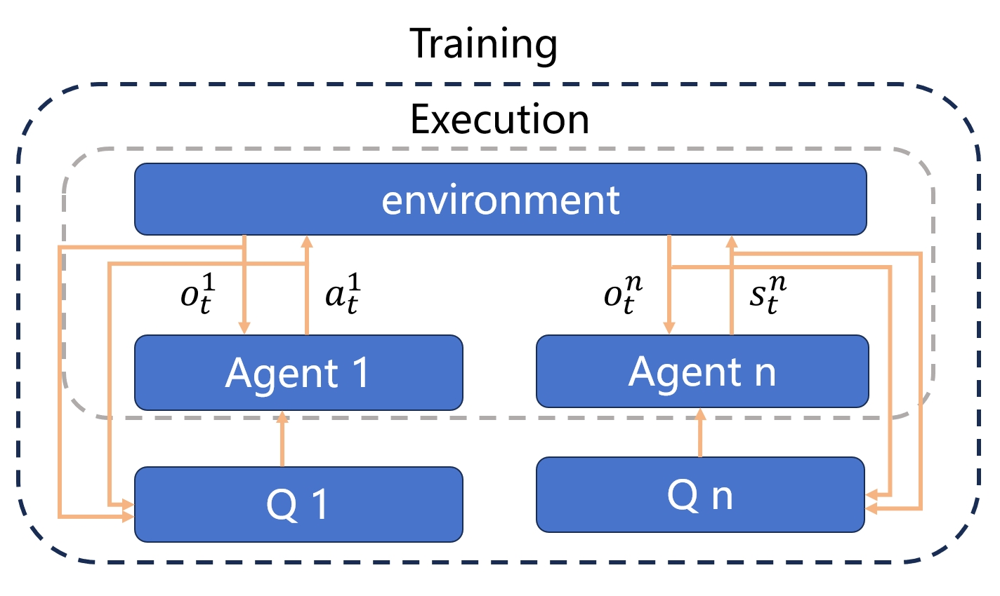
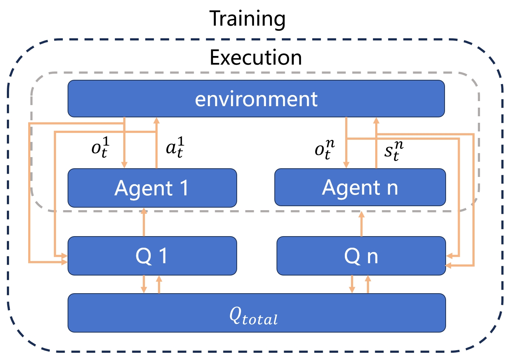

多智能体强化学习算法介绍(zhengyuwei)
=====================================

多智能体算法比单智能体算法更加复杂，因为每个智能体在和环境交互的同时，也在和其他智能体进行直接或者间接的交互。因此多智能体强化学习算法比单智能体强化学习算法更加困难，其难点主要体现为：

    * 由于多个智能体在环境中进行实时动态交互，并且每个智能体都在不断学习并且更新自身策略，因此在每个智能体的视角下，环境是非稳态的，及对于一个智能体而言，即使在相同的状态下采取相同的动作，得到的状态转移和奖励的分布也可能在不断变化。
    * 多个智能体的训练可能是多目标的，不同智能体需要最大化自己的利益。
    * 训练评估的复杂度会增加，可能需要大规模分布式训练来提高效率。

.. _IPPO:

IPPO(Independent Proximal Policy Optimization)
-------------------------------------------------

概念
^^^^^^^^^^^^^^^^^^^^^^^^^^

IPPO（Independent Proximal Policy Optimization）是一种完全去中心化（每个Agent独立和环境交互并用自己的观测和奖励来更新自己的策略）的算法，直接将PPO算法应用到多智能体环境中，即对多智能体环境中的每个智能体使用单智能体算法PPO进行训练。

.. image:: ../_static/images/algo/ippo.png

训练流程
^^^^^^^^^^^^^^^^^^^^^^^^^^^^

.. code-block::

    对于N个智能体，为每个智能体初始化各自的策略以及价值函数
    for 训练轮数 k=0,1,2,... do 
        所有智能体在环境中交互分别获得各自的一条轨迹数据
        对每个智能体，基于当前的价值函数用GAE计算优势函数的估计
        对于每个智能体，通过最大化其PPO-clip截断的目标来更新策略
        对于每个智能体，通过均方差误差损失函数优化其价值函数
    end for

形式化定义
^^^^^^^^^^^^^^^^^^^^^^^^^^

:math:`GAE` 的思想是从对第 1 步到 n 步计算出的各个优势函数进行加权，加权计算出的均值为最后的优势函数，这样做可以减少方差。

.. math:: 
    
    A_t^a = \sum_{l=0}^{h} (\gamma \lambda)^l \delta_{t+l}^{sa}\\
    \delta_t^a = r_t(z_t^a, u_t^a) + \gamma V_{\phi}(z_{t+1}^a) - V_{\phi}(z_t^a)

:math:`actor` 目标函数为

.. math::

    \mathcal{L}^a(\theta) = \mathbb{E}_{z_t^a, u_t^a} \left[ \min \left( \frac{\pi_{\theta}(u_t^a|z_t^a)}{\pi_{\theta_{old}}(u_t^a|z_t^a)} A_t^a, \text{clip}\left( \frac{\pi_{\theta}(u_t^a|z_t^a)}{\pi_{\theta_{old}}(u_t^a|z_t^a)}, 1-\epsilon, 1+\epsilon \right) A_t^a \right) \right]

:math:`critic` 目标函数为

.. math::

    \mathcal{L}^a(\phi) = \mathbb{E}_{z_t^a} \left[ \min \left( \left(V_{\phi}(z_t^a) - \hat{V}_t^a \right)^2, \left(V_{\phi_{old}}(z_t^a) + \text{clip}\left(V_{\phi}(z_t^a) - V_{\phi_{old}}(z_t^a), -\epsilon, +\epsilon\right) - \hat{V}_t^a \right)^2 \right) \right]

.. hint:: 

    实际上，缓冲区和智能体模型可以在不同的智能体之间共享也可以单独训练，这适用于全部 PPO 类算法。

.. _MAPPO:

MAPPO(Multi-Agent Proximal Policy Optimization)
-------------------------------------------------------------------

概念
^^^^^^^^^^^^^^^^^^^^^^^^^^^^^^^^^

MAPPO(Multi-Agent Proximal Policy Optimization)是基于PPO的多智能体版本，专门为多智能体环境设计。
MAPPO 继承了 IPPO 的核心特性，同时加了额外的机制比如一个中心化的critic函数，来处理多智能体之间的交互和协调。

相对于IPPO，MAPPO的主要改进是：

- **中心化训练与去中心化执行**：  MAPPO 通常使用中心化训练和去中心化执行框架（Centralized Training with Decentralized Execution, CDTE）框架。在此框架中，训练阶段利用利用所有智能体的信息来学习策略，但是在执行阶段，每个智能体仅使用自己的局部观测来制定决策，满足实时性和可扩展性的需求。
- **应对非静态环境**：  MAPPO 通过集中式训练可以更好地应对环境中的非静态性，因为所有智能体的策略更新都考虑了其他智能体的潜在行动和策略。这种方法能够促进更复杂的协同和竞争策略的形成。
- **学习效率和复杂环境的适应性**： 通过中央控制器的辅助，MAPPO能够在更复杂的多智能体环境中实现更高效的学习。集中处理所有智能体的信息可以帮助算法更快地识别有效的协作或对抗模式，从而加速学习过程。

.. image:: ../_static/images/algo/mappo.png

训练流程
^^^^^^^^^^^^^^^^^^^^^^^^^^^^^^^^^

训练流程和上述 IPPO 相同。

形式化定义
^^^^^^^^^^^^^^^^^^^^^^^^^^^^^^^^^

:math:`Critic` 更新：每次迭代给出一个更好的中心化的价值函数。

.. math::

    {\phi}_{k+1}=\arg \max_{\phi} \frac{1}{|D_k|\,T} \sum_{\tau \in D_k}\sum_{t=0}^{T} \left( V_{\left( \phi \right)}\left( o_t, s_t, u_t \right) - \hat{R}_t \right)^2

:math:`GAE` 函数： 给出当前动作相对于 :math:`critic value` 的好坏程度。

.. math::
   
    A_t^a = \sum_{l=0}^{h} (\gamma \lambda)^l \delta_{t+l}^{sa}\\
    \delta_t^a = r_t(z_t^a, u_t^a) + \gamma V_{\phi}(z_{t+1}^a) - V_{\phi}(z_t^a)

策略学习的损失函数：使用优势估计就散策略梯度来更新策略函数。

.. math::
    L(o, s, u, u', \theta_k, \theta) = \min \left( \frac{\pi_\theta(u|o)}{\pi_{\theta_k}(u|o)} A^{\theta_k}(o, s, u'), \text{clip}\left( \frac{\pi_\theta(u|o)}{\pi_{\theta_k}(u|o)}, 1-\epsilon, 1+\epsilon \right) A^{\theta_k}(o, s, u') \right)

:math:`D` 是收集到的可以在代理之间共享的轨迹。 :math:`R` 是奖励。 :math:`\tau` 是轨迹。 :math:`A` 是优势。 :math:`\gamma` 是折扣值。 
:math:`\lambda` 是GAE的权重值。 :math:`u` 是当前代理操作。 :math:`u'` 是除当前代理之外的所有代理的操作集。 
:math:`s` 是全局状态。 :math:`o` 是局部观察 
:math:`\epsilon` 是一个超参数，控制新策略允许与旧策略相差多远。 
:math:`V_{\phi}` 是价值函数，可以在代理之间共享。 
:math:`\pi_{\theta}` 是策略函数，可以在代理之间共享。

.. _MADDPG:

MADDPG(Multi-agent deep deterministic policy gradient)
-----------------------------------------------------------

概念
^^^^^^^^^^^^^^^^^^^^^

MADDPG(Multi-agent deep deterministic policy gradient) 算法是 DDPG(Multi-agent deep deterministic policy gradient) 算法对于多智能体的延申。每一个智能体均基于全局的 Q 函数以学习自身的策略。
在采样阶段， MADDPG 中的每哥智能体都遵循相同的 DDPG 算法来推断动作。不过每个智能体不是根据自己的动作计算 Q 值，而是使用集中式 Q 函数，该函数将所有智能体的动作作为输入来计算 Q 值。这需要在将数据存储到缓冲区之前在智能体之间共享数据。
在学习阶段，每个智能体使用目标策略预测其下一步行动，并在进入训练循环之前与其他智能体共享。这样做是为了确保所有代理在下一个采样阶段使用相同的操作来计算集中式 Q 函数中的 Q 值。

.. image:: ../_static/images/algo/maddpg.png

形式化定义
^^^^^^^^^^^^^^^^^^^^^^

:math:`Q-learning` ： 获得更好的集中式的Q函数。

.. math::

    L(\phi, D) = \mathbb{E}_{(o,s,u,r,o',s',d) \sim D} \left[ \left( Q_\phi(o, s, u, r, o', s', d) - \left( r + \gamma (1 - d) Q_{\phi_{\text{targ}}}(o', s', \mu_{\phi_{\text{targ}}}(o')) \right) \right)^2 \right]

策略更新： 通过更新策略函数来最大化 :math:`Q-Function` 输出。

.. math::

    \max_\theta \mathbb{E}_{o,s \sim D} \left[ Q_{\phi}(o, s, \mu_\theta(o)) \right]

:math:`D` 是重播缓冲区，可以在代理之间共享。 :math:`u` 是一个动作集，包括对手。 :math:`r` 是奖励。 :math:`s` 是观察/状态集，包括对手。 
:math:`s'` 是下一个观察/状态集，包括对手。 :math:`d` 当剧集结束时设置为 1（真），否则设置为 0（假）。 
:math:`\gamma` 是折扣值。 :math:`\mu_{\theta}` 是一个可以在代理之间共享的策略函数。 
:math:`Q_{\phi}` 是Q函数，可以跨agent共享。 :math:`\mu_{\theta_{targ}}` 是目标策略函数，可以在代理之间共享。 
:math:`Q_{\theta_{targ}}` 是目标 Q 函数，可以在代理之间共享。

.. _IQL:

IQL(Independent Q learning)
-----------------------------

概念
^^^^^^^^^^^^^^^^^^^^^^^^^^

IQL(Independent Q learning) 是 Q-learning 算法在多智能体环境下的自然拓展。
每个智能体利用自己 `buffer` 收集的数据训练一个标准DQN策略网络。这意味着每个智能体独立拥有属于自己的Q-Function而不是和其他智能体共享信息，不过IQL中也可以实现跨智能体的信息共享。

训练流程
^^^^^^^^^^^^^^^^^^^^^^^^^^^

.. code-block::

    对于N个智能体，为每个智能体初始化各自的Q函数和目标Q函数
    for 训练轮数 k=0,1,2,... do 
        所有智能体在环境中交互
        对每个智能体，基于当前时刻和下一时刻的观测和动作对当前动作的计算Q值和进行目标Q值估计
        最小化当前Q值和目标Q值的差距，从而优化更好的策略
    end for

形式化定义
^^^^^^^^^^^^^^^^^^^^^^^^^^^^

.. math::

    \phi_{k+1} = \arg\min_\phi \left( Q_\phi(s, a) - (r + \lambda \cdot \max_{a'} Q_{\phi_{\text{tar}}}(s', a')) \right)^2

.. hint:: 

    在多智能体学习领域，“信息共享”一词可能含糊不清，因此有必要在此进行澄清。信息共享可分为三种类型：

    - 真实/采样数据：观察、行动等。
    - 预测数据：Q/临界值、通信消息等。
    - 知识：经验回放缓冲区、模型参数等。

    IQL 可对经验回放缓冲区、模型参数等知识进行共享。

.. _VDN:

VDN(Value_Decomposition NetWorks)
------------------------------------

概念
^^^^^^^^^^^^^^^^^^^^^^^^^

VDN(Value_Decomposition NetWorks) 遵循和其他 Q-learning 算法相同的数据采样方式，在进入训练之前，每个智能体和其他智能体分享其 :math:`Q` 值和目标 :math:`Q` 值。
在训练的过程中，将当前智能体和其他智能体的 :math:`Q` 值和目标 :math:`Q` 值相加，得到 :math:`Q_{total}` 值，使得每个智能体能够结合其他智能体的行为对环境的影响，从而做出更加明智的决策。

形式化定义
^^^^^^^^^^^^^^^^^^^^^^^^^

:math:`Q_{total}` ：将全部智能体的 :math:`Q` 值来计算全局 :math:`Q` 值。

.. math:: 

    Q_{\phi}^{tot}=\sum_{l=0}^{n} Q_{\phi}^i

:math:`Q-Function` ：在每次迭代中获得对对全局 :math:`Q` 值的估计，并且将梯度传递给每个智能体的 :math:`Q` 值网络以完成更新。

.. math:: 

    L(\phi, D) = \mathbb{E}_{\tau \sim D} \left[ Q^{tot}_\phi - \left( r + \gamma (1 - d) Q^{tot'}_{\phi_{targ}} \right)^2 \right]

.. hint::
    VDN 通过简单将所有奖励相加的操作来优化多个代理的联合策略。
    然而，此操作减少了策略的表示，因为提取的去中心化策略不需要完全分解来与中心化策略完全一致。
    即VDN强制每个智能体寻找最佳动作来满足以下方程：

    .. math::

        \begin{equation}
        \arg\max_{u} Q_{\text{tot}}(\tau, u) =
        \left\{
        \begin{array}{l}
        \arg\max_{u^1} Q_1(\tau^1, u^1) \\
        \vdots \\
        \arg\max_{u^n} Q_n(\tau^n, u^n)
        \end{array}
        \right.
        \end{equation}

.. _QMIX:

QMIX
---------------------

概念
^^^^^^^^^^^^^^^^^^^^^^^^^

与 VDN(Value_Decomposition NetWorks) 简单对全部智能体的 Q 值进行相加不同， QMIX 使用了一个前馈神经网络 Mixer ，将不同智能体的策略网络输出作为输入，并且将它们单调地混合。
其中施加得的约束方程如下:

    .. math::

        \frac{\partial Q_{tot}}{\partial Q_a} \geq 0, \forall a \in A

为了满足单调约束，混合网络的权重被限制为非负数。

.. image:: ../_static/images/algo/qmix.png

形式化定义
^^^^^^^^^^^^^^^^^^^^^^^^^

QMIX 需要不同的智能体共享信息，此处使用加粗的符号来标识包含多个智能体的信息。

:math:`Q-mix` ：基于前馈神经网络实现的混合器，通过 :math:`Q-mix`` 混合全部 Q 值来计算全局 Q 值。

.. math::

    \mathbf{Q}_{total}(\mathbf{a},\mathbf{s};\phi,\psi)=g_{\psi}(\mathbf{s},Q_{\phi_1},Q_{\phi_2},...,Q_{\phi_n})
    
:math:`Q-Function` ：在每次迭代中获得对对全局 :math:`Q` 值的估计，并且将梯度传递给混合器和每个智能体的 :math:`Q` 值网络以完成更新。

.. math::

     L(\phi, D) = \mathbb{E}_{\tau \sim D} \left[ Q^{tot}_\phi - \left( r + \gamma (1 - d) Q^{tot'}_{\phi_{targ}} \right)^2 \right]