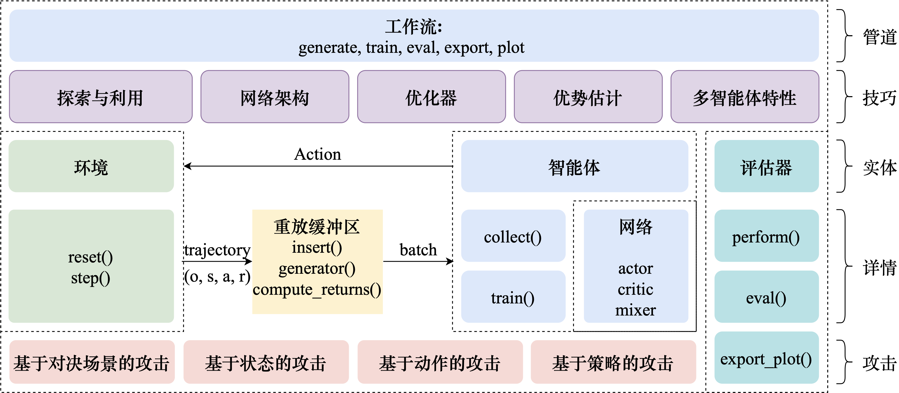

项目架构
============

.. 这里放置项目架构图

算法内核简介
---------------------
.. 这里放一下项目的目录结构，cd amb && tree -L 2 -d -I pycache 

.. code-block::

    .
    ├── agents
    │   ├── base_agent.py
    │   ├── coma_agent.py
    │   ├── ddpg_agent.py
    │   ├── ppo_agent.py
    │   └── q_agent.py
    ├── algorithms
    │   ├── igs.py
    │   ├── __init__.py
    │   ├── maddpg.py
    │   ├── mappo.py
    │   └── q.py
    ├── configs
    │   ├── algos_cfgs
    │   └── envs_cfgs
    ├── data
    │   └── episode_buffer.py
    ├── envs
    │   ├── base_logger.py
    │   ├── dual_logger.py
    │   ├── env_example.py
    │   ├── env_wrappers.py
    │   ├── football
    │   ├── gym
    │   ├── __init__.py
    │   ├── mamujoco
    │   ├── metadrive
    │   ├── pettingzoo_mpe
    │   ├── quads
    │   ├── requirements.txt
    │   ├── smac
    │   ├── smacv2
    │   └── toy_example
    ├── models
    │   ├── actor
    │   ├── base
    │   ├── critic
    │   └── mixer
    ├── runners
    │   ├── dual
    │   ├── dual_traitor
    │   ├── __init__.py
    │   ├── perturbation
    │   ├── single
    │   └── traitor
    └── utils
        ├── config_utils.py
        ├── env_utils.py
        ├── model_utils.py
        ├── popart.py
        └── trans_utils.py

.. 对上述目录结构的解释与描述，对比着https://aisafety.readthedocs.io/zh_CN/latest/Start/05_frame.html 

agents
^^^^^^^^^^^^^^^^^^^^^^
agents目录下存放的是对智能体的抽象及实现。其中base_agent.py为智能体的抽象类，其他文件为不同算法的实现。BaseAgent类中包含的方法有：

- ``forward(obs, rnn_states, masks, available_actions=None)`` : 用于智能体的前向传播，输入观测，输出动作概率分布（Distribution类）。
- ``sample(obs, available_actions=None)`` : 用于从动作概率分布中采样动作。
- ``perform(obs, rnn_states, masks, available_actions=None, deterministic=False)`` : 输入观测，输出动作概率。与forward的区别是，perform代表的是测试阶段的表现，通过deterministic来决定测试时是否要用随机策略。
- ``collect(obs, rnn_states, masks, available_actions=None, t=0)`` : 用于训练阶段的数据采集，输入观测，输出动作概率分布，以及下一步的rnn状态。
- ``save(path)`` : 保存模型。
- ``restore(path)`` : 加载模型。
- ``prep_training()`` : 用于训练前的准备工作，包括重置rnn状态，重置动作概率分布等。
- ``prep_rollout()`` : 用于测试前的准备工作，包括重置rnn状态，重置动作概率分布等。

algorithms
^^^^^^^^^^^^^^^^^^^^^^
algorithms目录下存放的是对算法的具体实现，封装了一个算法的具体实现流程。其中算法类中通过调用Agent对象来执行智能体具体的采样、执行动作等操作：

- igs.py: 
- maddpg.py: 
- mappo.py: 
- q.py: 

configs
^^^^^^^^^^^^^^^^^^^^^^
configs为配置文件目录，包括算法配置文件和环境配置文件。

- **algos_cfgs**：算法配置文件，包括算法的超参数配置，训练配置，模型配置等。
- **envs_cfgs**：目录下为环境配置文件，包括环境的超参数配置，环境的观测空间，动作空间、智能体数量等。

data
^^^^^^^^^^^^^^^^^^^^^^
data目录下定义了数据的组织方式。其中episode_buffer.py定义了数据的存储方式，包括数据的存储、读取、清空等操作。

envs
^^^^^^^^^^^^^^^^^^^^^^
envs是平台提供的多智能体环境库，可以自定义添加，目前支持的环境列表见 支持环境列表_

models
^^^^^^^^^^^^^^^^^^^^^^
models目录下存放的是智能体的网络结构，包括actor、critic、mixer等。

runners
^^^^^^^^^^^^^^^^^^^^^^
runners目录下存放的是训练和测试的具体实现，包括：

- Single MARL training
- Perturbation-based attacks & traitors
- Adversarial traitors
- Dual MARL training
- Traitors in dual MARL

utils
^^^^^^^^^^^^^^^^^^^^^^
utils目录下存放的是一些工具函数，包括配置文件的读取、模型的保存与加载、环境的创建等。

支持环境列表
---------------------

- :ref:`SMAC`
- :ref:`SMACv2`
- :ref:`MAMuJoCo`
- :ref:`MPE`
- :ref:`GRF`
- :ref:`Gym`
- :ref:`Toy`
- :ref:`Bi-DexHands`
- :ref:`Quads`
- :ref:`Network`
- :ref:`Voltage`

支持MARL算法列表
---------------------
.. 此处可以暂时留空，后续直接挂引用

- :ref:`IPPO`
- :ref:`MAPPO`
- :ref:`MADDPG`
- :ref:`IQL`
- :ref:`VDN`
- :ref:`QMIX`

支持对抗攻击算法列表
---------------------
.. 此处可以暂时留空，后续直接挂引用

- :ref:`RandomNoise`
- :ref:`IterativePerturbation`
- :ref:`AdaptiveAction`
- :ref:`RandomPolicy`
- :ref:`Traitor`
- :ref:`Dual`
