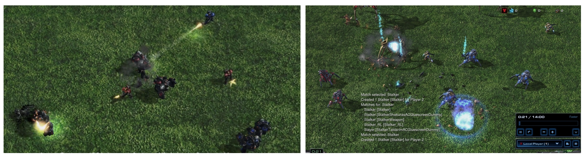
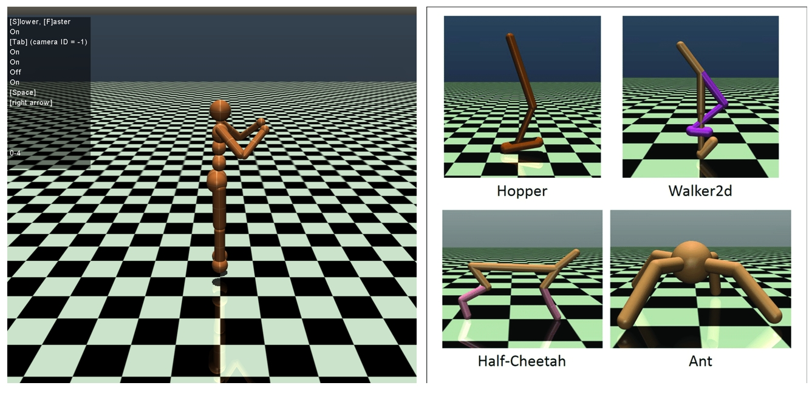
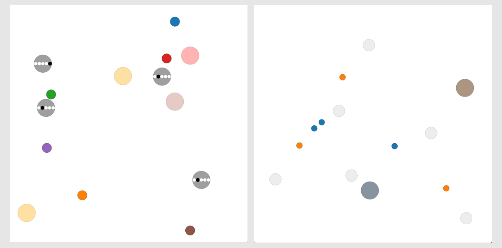
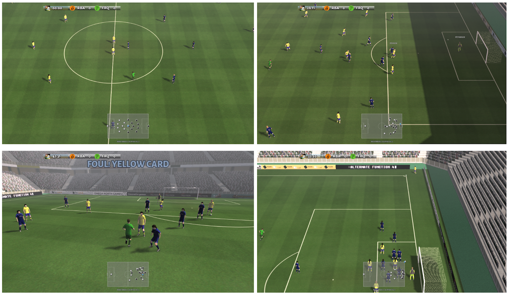
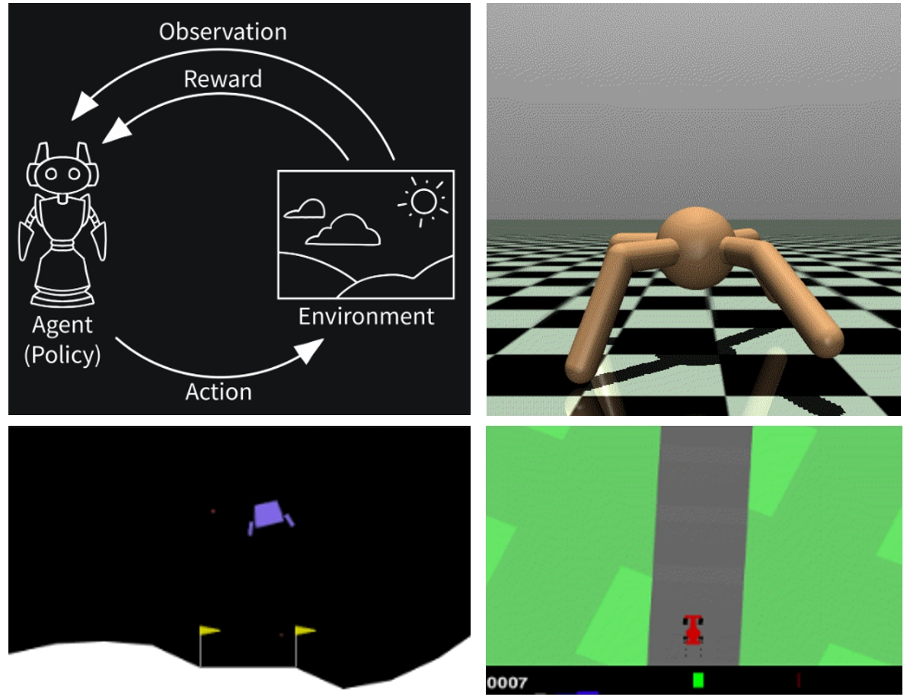
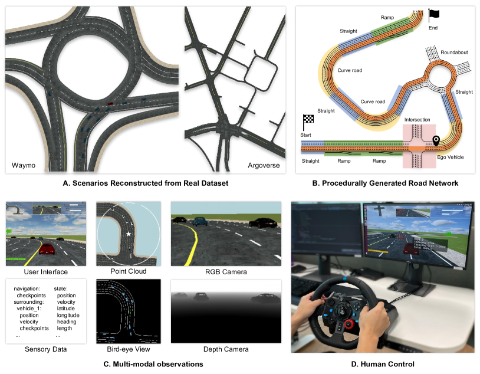

环境介绍(zhenyyuwei)
============================
.. 此处按骏哥儿README列出的环境来，内容借鉴MARLlib的介绍，其中需要包含一张环境的图片、一段话简介、官方链接、安装方法、使用方法。最后可以一个表格总结所有环境（任务模式、可观测性、动作空间、观测空间维度、全局状态、全局状态维度、回报、交互模式等）。例如下面的示例：

.. _SMAC:

SMAC
---------------------

.. image:: ../_static/images/env/smac.png

SMAC 是 WhiRL 基于暴雪星际争霸 II RTS 游戏的协作多智能体强化学习 (MARL) 领域的研究环境。 
SMAC 利用暴雪的星际争霸 II 机器学习 API 和 DeepMind 的 PySC2 为自主代理提供便捷的接口，以便与星际争霸 II 交互、获取观察结果并执行操作。
与 PySC2 不同，SMAC 专注于去中心化的微观管理场景，其中游戏的每个单元都由单独的 RL 代理控制。

官方链接: `oxwhirl/smac <https://github.com/oxwhirl/smac>`_

环境特征
~~~~~~~~~~~~~~~~~~~~

.. csv-table::
    :header: "环境", "任务模式", "可观测性", "动作空间", "回报", "交互模式"
    :widths: 20, 20, 20, 20, 20, 20

    "SMAC", "合作", "部分可观测", "离散", "稠密/稀疏", "同时"

安装方法
~~~~~~~~~~~~~~~~~~~~

安装 StarCraft II
++++++++++++++++++++++

StarCraftII 是 SMAC 所调用的游戏引擎， SMAC 需要通过调用 StarCraftII 游戏引擎进行对局，所以在安装 SMAC 之前要安装 StarCraftII 。

切换到要安装StarCraftII的目录，然后运行以下命令：

.. code-block:: bash

    wget https://blzdistsc2-a.akamaihd.net/Linux/SC2.4.10.zip
    unzip -P iagreetotheeula SC2.4.10.zip
    rm -rf SC2.4.10.zip
    cd StarCraftII/
    wget https://raw.githubusercontent.com/Blizzard/s2client-proto/master/stableid.json

在 ``~/. bashrc`` 中添加以下行：

.. code-block:: bash

    export SC2PATH="/path/to/your/StarCraftII"

将 ``amb/envs/smac/SMAC_Maps`` 目录复制到 ``StarCraftII/Maps`` 。

安装SMAC
++++++++++++++++++++++

.. code-block:: bash

    pip install git+https://github.com/oxwhirl/smac.git

使用方法
~~~~~~~~~~~~~~~~~~~~

更改 ``amb/configs/env_cfgs/smac.yaml`` 配置项：

.. code-block:: yaml

    map_name: 3s_vs_4z
    state_type: FP # choose from FP (Feature Pruned) and EP (Environment Provided)
    replay_dir: ""
    replay_prefix: ""

训练时指定环境：

.. code-block:: bash

    python -u single_train.py --env smac --algo mappo --run single   

.. hint:: 项目可自动查找环境名称对应的配置项，保持名称相同即可。

.. _SMACv2:

SMACv2
---------------------

SMACv2 是对 SMAC 的更新， SMACv2 和 SMAC 主要是关注非中心的具体场景，而不是一场完整的游戏对局。
SMACv2 和 SMAC 同样通过 DeepMind 提供的 pysc2 和 Blizzard 提供的 StarCraftII 机器学习 API 。

SMACv2 相对于 SMAC 进行了三项主要改动:

- 随机化起始位置
- 随机化单位类型
- 更改单位的视野范围和攻击范围

官方链接: `oxwhirl/smacv2 <https://github.com/oxwhirl/smacv2>`_

环境特征
~~~~~~~~~~~~~~~~~~~~

.. csv-table::
    :header: "环境", "任务模式", "可观测性", "动作空间", "回报", "交互模式"
    :widths: 20, 20, 20, 20, 20, 20

    "SMACv2", "合作", "部分可观测", "离散", "稠密/稀疏", "同时"

安装方法
~~~~~~~~~~~~~~~~~~~~

安装 StarCraft II
++++++++++++++++++++++

StarCraftII 是 SMAC 所调用的游戏引擎， SMAC 需要通过调用 StarCraftII 游戏引擎进行对局，所以在安装 SMAC 之前要安装 StarCraftII 。

切换到要安装StarCraftII的目录，然后运行以下命令：

.. code-block:: bash

    wget https://blzdistsc2-a.akamaihd.net/Linux/SC2.4.10.zip
    unzip -P iagreetotheeula SC2.4.10.zip
    rm -rf SC2.4.10.zip
    cd StarCraftII/
    wget https://raw.githubusercontent.com/Blizzard/s2client-proto/master/stableid.json

在 ``~/. bashrc`` 中添加以下行：

.. code-block:: bash

    export SC2PATH="/path/to/your/StarCraftII"

将 ``amb/envs/smacv2/SMAC_Maps`` 目录复制到 ``StarCraftII/Maps`` 。

安装SMACv2
++++++++++++++++++++++

.. code-block:: bash

    pip install git+https://github.com/oxwhirl/smacv2.git

如果需要扩展 SMACv2 ，必须按照以下安装：

.. code-block:: bash

    git clone https://github.com/oxwhirl/smacv2.git
    cd smacv2
    pip install -e ".[dev]"
    pre-commit install

使用方法
~~~~~~~~~~~~~~~~~~~~

更改 ``amb/configs/env_cfgs/smacv2.yaml`` 配置项：

.. code-block:: yaml

    map_name: protoss_5_vs_5

修改该配置下的地图名称，会选择 ``amb/configs/env_cfgs/smacv2_map_config`` 下对应的地图配置文件  ``amb/configs/env_cfgs/smacv2_map_config/{map_name}.yaml`` 。
其中包括各种详细的设定。

.. code-block:: bash

    continuing_episode: False
    difficulty: "7"
    game_version: null
    map_name: "10gen_protoss"
    move_amount: 2
    obs_all_health: True
    obs_instead_of_state: False
    obs_last_action: False
    obs_own_health: True
    obs_pathing_grid: False
    obs_terrain_height: False
    obs_timestep_number: False
    reward_death_value: 10
    reward_defeat: 0
    reward_negative_scale: 0.5
    reward_only_positive: True
    reward_scale: True
    reward_scale_rate: 20
    reward_sparse: False
    reward_win: 200
    replay_dir: ""
    replay_prefix: ""
    conic_fov: False
    use_unit_ranges: True
    min_attack_range: 2
    obs_own_pos: True
    num_fov_actions: 12
    capability_config:
    n_units: 5
    n_enemies: 5
    team_gen:
        dist_type: "weighted_teams"
        unit_types:
        - "stalker"
        - "zealot"
        - "colossus"
        weights:
        - 0.45
        - 0.45
        - 0.1
        observe: True
    start_positions:
        dist_type: "surrounded_and_reflect"
        p: 0.5
        map_x: 32
        map_y: 32

    # enemy_mask:
    #   dist_type: "mask"
    #   mask_probability: 0.5
    #   n_enemies: 5
    state_last_action: True
    state_timestep_number: False
    step_mul: 8
    heuristic_ai: False
    # heuristic_rest: False
    debug: False

训练时指定环境：

.. code-block:: bash

    python -u single_train.py --env smacv2 --algo mappo --run single   

.. _MAMuJoCo:

Multi-Agent MuJoCo
---------------------

MAMujoco 是一个支持多个智能体进行机器人控制的环境。
是基于广为流行的单智能体机器人控制平台 Mujoco 为基础，提供了各种任务场景，包括人形机器人、蛇形机器人、四足行走机器人等多种任务场景。
其中属于同一个机器人的多个智能体需要协作解决任务。

官方链接: `google-deepmind/mujoco <https://github.com/google-deepmind/mujoco>`_

环境特征
~~~~~~~~~~~~~~~~~~~~

.. csv-table::
    :header: "环境", "任务模式", "可观测性", "动作空间", "回报", "交互模式"
    :widths: 20, 20, 20, 20, 20, 20

    "MAMujoco", "合作/协作", "部分可观测", "连续", "稠密", "同时"

安装方法
~~~~~~~~~~~~~~~~~~~~

安装 mujoco
++++++++++++++++++++++

mujoco 是 MAMujoco 所使用的物理引擎，现在可以直接使用 `pip` 进行安装。 

.. code-block:: bash

    pip install mujoco

安装 gymnasium-robotics
+++++++++++++++++++++++++++

gymnasium-robotics 是管理多智能体强化学习的 API ，通过调用 gymnasium-robotics 的接口来使用 MAMujoco 。

.. code-block:: bash

    pip install gymnasium-robotics==1.2.3

使用方法
~~~~~~~~~~~~~~~~~~~~

更改 ``amb/configs/env_cfgs/mamujoco.yaml`` 配置项：

.. code-block:: bash

    scenario: HalfCheetah
    agent_conf: 6x1
    agent_obsk: 1
    # render_mode: "human"

训练时指定环境：

.. code-block:: bash

    python -u single_train.py --env mamujoco --algo mappo --run single   

.. _MPE:

PettingZoo MPE
---------------------

MPE(Multi-particle Environms) 是一个面相通信的环境，环境中的量子智能体可以移动，通信，相互观测，相互交互以及和地图中的固定地标交互。
具有连续观察和离散动作空间，和一些基本的物理模拟。

官方链接: `openai/multiagent-particle-envs <https://github.com/openai/multiagent-particle-envs>`_

环境特征
~~~~~~~~~~~~~~~~~~~~

.. csv-table::
    :header: "环境", "任务模式", "可观测性", "动作空间", "回报", "交互模式"
    :widths: 20, 20, 20, 20, 20, 20

    "pettingzoo_mpe", "合作/协作/竞争/混合", "全局可观测", "离散+连续", "稠密", "同时/异步"

安装方法
~~~~~~~~~~~~~~~~~~~~

安装 pettingzoo==1.24.1
+++++++++++++++++++++++++++

mpe 环境现已经被集成到 pettingzoo 中，安装 pettingzoo 即可调用 mpe 环境。

.. code-block:: bash

    pip install pettingzoo==1.24.1
    pip install supersuit==3.9.0

使用方法
~~~~~~~~~~~~~~~~~~~~

更改 ``amb/configs/env_cfgs/pettingzoo_mpe.yaml`` 配置项：

.. code-block:: bash

    scenario: simple_spread_v3 # choose from simple_spread_v3, simple_reference_v3, simple_speaker_listener_v4
    continuous_actions: True

训练时指定环境：

.. code-block:: bash

    python -u single_train.py --env pettingzoo_mpe --algo mappo --run single  

.. _GRF:

Google Research Football
-------------------------------

Google Research Football 是基于开源游戏 Gameplay Football 的RL环境。
其中智能体接受训练，在基于物理模拟的 3D 模拟器中踢足球。

官方链接: `google-research/football <https://github.com/google-research/football>`_

环境特征
~~~~~~~~~~~~~~~~~~~~

.. csv-table::
    :header: "环境", "任务模式", "可观测性", "动作空间", "回报", "交互模式"
    :widths: 20, 20, 20, 20, 20, 20

    "Google Research Football", "合作/协作", "全局可观测", "离散", "稀疏", "同时"

安装方法
~~~~~~~~~~~~~~~~~~~~

安装 Google Research Football
++++++++++++++++++++++++++++++++++++++

Google Research Football 的安装需要依赖一些系统级别的依赖。

.. code-block:: bash

    sudo apt-get install git cmake build-essential libgl1-mesa-dev libsdl2-dev \
    libsdl2-image-dev libsdl2-ttf-dev libsdl2-gfx-dev libboost-all-dev \
    libdirectfb-dev libst-dev mesa-utils xvfb x11vnc python3-pip

在完成对系统级别的依赖进行安装之后，直接使用 `pip` 对 Google Research Football进行安装。

.. code-block:: bash

    pip install gfootball

使用方法
~~~~~~~~~~~~~~~~~~~~

更改 ``amb/configs/env_cfgs/football.yaml`` 配置项：

.. code-block:: bash

    env_name: academy_pass_and_shoot_with_keeper
    stacked: False
    representation: simple115v2
    rewards: scoring,checkpoints
    write_goal_dumps: False
    write_full_episode_dumps: False
    render: False
    write_video: False
    dump_frequency: 1
    logdir: ~
    extra_players: ~
    number_of_left_players_agent_controls: 2 # has to be consistent with the default setting below
    number_of_right_players_agent_controls: 0
    channel_dimensions:
    - 96
    - 72
    other_config_options: ~
    # env_num_agents (for REFERENCE):
    #   "academy_pass_and_shoot_with_keeper": 2,
    #   "academy_run_pass_and_shoot_with_keeper": 2,
    #   "academy_3_vs_1_with_keeper": 3,
    #   "academy_counterattack_easy": 4,
    #   "academy_counterattack_hard": 4,
    #   "academy_corner": 11,
    #   "academy_single_goal_versus_lazy": 11

训练时指定环境：

.. code-block:: bash

    python -u single_train.py --env football --algo mappo --run single  

.. _Gym:

Gym
---------------------

gym 是由 OPENAI 公司开发的集成了多种强化学习环境的泛用强化学习库，提供了一个简单且通用的接口来训练代理在各种环境中的表现。gym 包含了多种标准测试环境，使研究人员和开发者可以在相同的条件下测试和比较他们的算法。

官方链接: `gymlibrary <https://www.gymlibrary.dev/content/basic_usage/>`_

环境特征
~~~~~~~~~~~~~~~~~~~~

.. csv-table::
    :header: "环境", "任务模式", "可观测性", "动作空间", "回报", "交互模式"
    :widths: 20, 20, 20, 20, 20, 20

    "gym", "合作/协作/竞争", "全局可观测/部分可观测", "离散/连续", "稠密/稀疏", "同时"

安装方法
~~~~~~~~~~~~~~~~~~~~

安装 gym
++++++++++++++++++++++++++++

.. code-block:: bash

    pip install gym

使用方法
~~~~~~~~~~~~~~~~~~~~

更改 ``amb/configs/env_cfgs/gym.yaml`` 配置项：

.. code-block:: bash

    scenario: Ant-v2 # LunarLanderContinuous-v2, CarRacing-v0 选择具体的场景

训练时指定环境：

.. code-block:: bash

    python -u single_train.py --env gym --algo mappo --run single  

.. _Toy:

Toy Example
---------------------

.. image:: ../_static/images/env/toy.png

Toy Example 主要设计用于探索代理间的协作或对抗策略。环境具有一个简单的二元状态（0.0或1.0），代表两种不同的配置。每个代理都可以选择两种行动之一。环境的观察空间根据是否包含最后一次的状态和动作而变化，基础观察包括当前状态和代理标识。环境逻辑依赖于两个代理行动的一致性：如果一致，则状态转换并根据当前状态给予奖励；如果不一致，则状态保持不变。环境通过限定步数实现结束条件，提供重置和种子设定功能以支持实验的可复现性。这个环境非常适合用来开发和测试多智能体系统的交互策略，通过调整观察空间的复杂度来适应不同的学习需求和挑战。

环境特征
~~~~~~~~~~~~~~~~~~~~

.. csv-table::
    :header: "环境", "任务模式", "可观测性", "动作空间", "回报", "交互模式"
    :widths: 20, 20, 20, 20, 20, 20

    "toy", "合作", "全局可观测", "离散", "稠密", "同时"

安装方法
~~~~~~~~~~~~~~~~~~~~

toy 内置在 AMB 代码中，不需要通过 pip 下载额外的依赖。

使用方法
~~~~~~~~~~~~~~~~~~~~

更改 ``amb/configs/env_cfgs/toy.yaml`` 配置项：

.. code-block:: bash

    obs_last_state: True
    obs_last_action: True

训练时指定环境：

.. code-block:: bash

    python -u single_train.py --env toy --algo mappo --run single  

.. _MetaDrive:

MetaDrive
---------------------

MetaDrive 是一款驾驶模拟器，支持使用道路地图和交通生成场景。
提供精确的物理模拟和支持多种感知输入，包括激光雷达、 RGB 图像，自下而上的语义图和第一人称视角。

官方链接: `metadriverse/metadrive <https://github.com/metadriverse/metadrive>`_

环境特征
~~~~~~~~~~~~~~~~~~~~

.. csv-table::
    :header: "环境", "任务模式", "可观测性", "动作空间", "回报", "交互模式"
    :widths: 20, 20, 20, 20, 20, 20

    "MetaDrive", "协作", "部分可观测", "连续", "稠密", "同时"

安装方法
~~~~~~~~~~~~~~~~~~~~

安装 MetaDrive
++++++++++++++++++++++

.. _自定义环境:

自定义环境
---------------------

如何实现一个新的自定义环境
~~~~~~~~~~~~~~~~~~~~~~~~~~~~~~~~~

- 修改环境本身，或给原有的环境套一个 `wrapper`，使得环境符合amb的接口
- 修改 `amb/utils/env_utils.py`，在 `make_train_env`， `make_eval_env`， `make_render_env` 函数中添加自定义环境的信息
- 修改 `amb/utils/config_utils.py`，在 `get_task_name` 中添加自定义环境任务名信息

自定义环境接口介绍
~~~~~~~~~~~~~~~~~~~~~~~~~~~~~~~~~

- 环境的配置参数全部写在 `amb/configs/envs_cfgs/{环境名}.yaml` 中，这些参数会被以字典形式读入，并借由 `make_xxx_env` 函数的 `env_args` 传入给环境
- 你的环境类需要满足 `amb/envs/env_example.py` 中的所有接口，包括输入输出的类型限制和要求

需要给 `Dual` 环境写一个专门的 `logger`